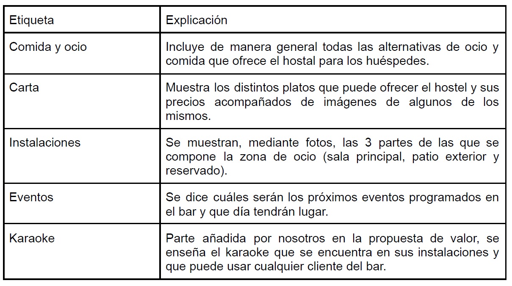
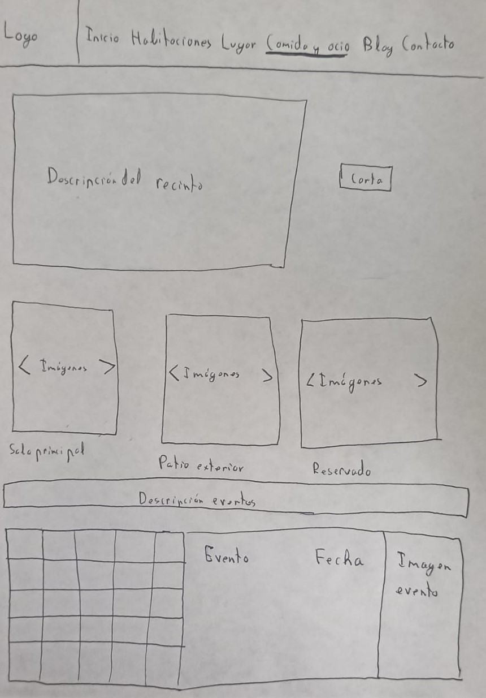

# DIU21
Prácticas Diseño Interfaces de Usuario 2020-21 (Tema: Turismo) 

Grupo: DIU2_ML.  Curso: 2021/21 

Proyecto: 
Carlota Braun

Descripción: 

Hostel que se encuentra en el centro de Granada y que está orientado sobre toda a los jóvenes, y que además cuenta con una zona de restauración con conciertos y espectáculos ciertos días.

Miembros

👤 Manuel Contreras Orge  :octocat:

👤 Luis Ortega Palacios :octocat:

La práctica se puede consultar en https://github.com/manuelcoor66/DIU-Practicas.

----- 

# Proceso de Diseño 

## Paso 1. UX Desk Research & Analisis 

 1.a Análisis competitivo
-----

A la hora de comparar nuestro hostel hemos decidido usar The Hat Madrid y The Lights Hostel Malaga, debido a que el primero de ellos (The Hat) cuenta con una página web que es mejor que aquella con la que la vamos a comparar, mientras que la segunda (The Lights Hostel) tiene una página peor.

**Página Web The Hat Madrid: https://apps.apple.com/es/app/gu%C3%ADa-bienvenidos-a-madrid/id632497903**

**Página Web The Lights Hostel Málaga: https://www.esmadrid.com/app-paseo-arte-imprescindible**

El resultado de la comparación entre estos 3 hostel se ve en la siguiente tabla.

 1.b Persona
-----
### Persona 1 (Matías)

Hemos escogido esta persona porque encaja en la idea general de quien podría ser un
visitante al uso de un hostel. Alguien sociable, que le va la marcha y que tiene un incentivo para venir aquí más allá de pasarlo bien, y al mismo tiempo confía más en las
recomendaciones online que en la publicidad tradicional por lo que puede ser un buen
sujeto para el Journey Map.

### Persona 2 (María)

La elección de esta persona como usuaria de un hostel es que es una persona con un
carácter que se encuentra entre extrovertida e introvertida, pero que le gustaría mejorar ser un poco más extrovertida, por lo que ambientes como los de sitios así le ayudan mucho a la hora de poder conseguirlo. Además, al ser una persona bastante práctica, es la persona perfecta para elegir un hostel dentro de las distintas posibilidades existentes para ella, ya que es el que tiene las mejores características para lo que ella se puede permitir.

 1.c User Journey Map
----
### Persona 1 (Matías)

Cogiendo como base el ejemplo lo hemos adaptado a lo que nuestra persona ficticia haría,
es por ello por lo que, por ejemplo, el hecho de que no se puedan poner ni hayan muchas
reviews en la página principal del hostel es visto como algo negativo, o el porque, siendo
una persona sociable le preocupa caerle bien a la gente.

### Persona 2 (María)

Cogiendo como base el ejemplo lo hemos adaptado a lo que nuestra persona ficticia haría, es por ello por lo que, por ejemplo, el hecho de que no se puedan poner ni hayan muchas reviews en la página principal del hostel es visto como algo negativo, o el porque, siendo una persona sociable le preocupa caerle bien a la gente.

 1.d Usability Review
----

Este diagrama se observa en este [documento][enlace] adjunto.

[enlace]: P1/Usability_Review.pdf

A pesar de que la página no es perfecta, se hace un muy buen trabajo con lo que tiene,
pudiendo mejorarse lo cargado que está la página principal, ya que la encontramos
demasiada cargada, pudiendo accederse sólo a cierta parte de la información mediante el
menú principal, mientras que la mayoría de información se encuentra en la página principal,
lo que puede llegar a confundir un poco, por lo que se recomienda dividir la información en
distintas páginas en las que solo se encuentra información relacionada con esta parte. La
claridad visual es excelente, ya que se destacan las partes más importantes de la página
con un color llamativo y/o una letra de mayor tamaño. Sin embargo, vemos pobre la parte
de la ayuda al usuario, ya que existe una sección de FAQ que es muy fácil que se pueda
pasar por alto por parte del usuario.
Por último, al analizar esta página web, llegamos a la conclusión de que se ha hecho un
buen trabajo al realizarla, pero que existen algunas partes mejorables que harían que esta
fuera excelente.

## Paso 2. UX Design  

 2.a Feedback Capture Grid / EMpathy map / POV
----

En este apartado hemosrealizado las 3 opciones disponibles, (malla receptora, mapa de empatía y POV), aunque solo es necesario observar una de las 3 opciones.

### Malla receptora de información
#### Interesante/relevante:
-Se puede contactar fácilmente a partir de Whatsapp.

-La página es fácilmente navegable.

-Se puede acceder a reserva directamente.

-Te explica claramente todas las actividades que se ofertan.

-Se observan las partes más importantes de manera clara.

#### Críticas Constructivas:
-No hay ofertas que podrían hacer el hostel más accesible.

-Las reviews del hostel solo las pueden poner los dueños del hostel lo cual hace que alguien pueda sospechar que han sido escogidas a dedo para dar buena imagen.

#### Preguntas a partir de la experiencia:
-¿Dónde están las ofertas?

-¿Por qué hay información sobre el hostel fuera de la zona principal?

#### Nuevas ideas:
-Poner los lugares de fiesta cercanos.

-La página principal está cargada, lo podrían dividir en distintas pestañas.

-Poner redes sociales.

### Mapa de empatía

#### Persona 1 (Matías)

#### Persona 1 (María)

### POV

El USUARIO

NECESITA

-Reservar en el hostel

-Información de los lugares cercanos al hostel

-Cancelar la reserva

PORQUE

-Quiere pasar un fin de semana en Granada

-Le facilita el trabajo para organizar su viaje

-Puede que los planes fallen

 2.b ScopeCanvas
----

Nuestra propuesta para mejorar el servicio ofrecido por el hostel Carlota Braun es añadirle
un servicio de karaoke por las noches, después de que acaben las actuaciones, que son muy comunes a la hora de cenar. Este servicio está ofrecido a aquellas personas que se encuentran en el bar y que se lo quieran pasar bien de una manera diferente a lo común en sitios como estos.

 2.b Tasks analysis 
-----

Hemos escogido la matriz de tareas/usuarios por delante del user/task flow debido a que
esta primera es una opción mucho más fácil de observar e intuitiva que la otra, ya que con
un solo vistazo se puede ver claramente la información más importante que se encuentra en
esta opción, mientras que la otra es mucho más compleja y difícil de entender.

 2.c IA: Sitemap + Labelling 
----

#### Mapa de sitio

Comida y ocio sucede en un mismo restaurante con un escenario pero los eventos la página los tiene separados en una pestaña aparte, no lo vemos apropiado y creemos que sería más coherente juntarlo.

#### Etiquetado

 2.d Wireframes
-----

El boceto es básico pero ofrece una idea de lo que queremos hacer. Se mantendrán los
colores de la página original, y en el calendario, cuando se pasa el cursor por encima de un
evento, se mostrará a la derecha, tal y como se enseña en el boceto todos los datos de
dicho evento (tales como nombre, fecha, breve descripción e imágenes relacionadas), en el
caso de que no se seleccione ninguno se mostrará el próximo evento.

## Paso 3. Mi UX-Case Study (diseño)
# DIU - Practica 3

 3.a Moodboard
-----

 

En el Moodboard se incluyen los principales elementos de diseño a considerar antes de comenzar con el bocetaje HI-FI de la aplicación, destacando: 

* **Paleta de colores** 

Se ha seleccionado esta paleta de colores ya que refleja las principales característicos del pueblo: los colores teja claros y oscuros representativos de los tradicionales tejados de las antiguas casas, los colores verdosos asociados a la vegetación típica de la zona (musgo y matorrales) y el azul que recuerda al cielo y el agua del río que atraviesa el pueblo. Además, se han añadido dos colores adicionales a la paleta (lateral derecho) con el suficiente contrase y armonía respecto a los seleccionados, orientados a servir como colores de acentuación (botones dedicados a acciones importantes).

* **Imágenes inspiradoras**

En este caso, las imágenes que han inspirado la selección de colores comentados previamente han sido imágenes de zonas muy características del pueblo. De este modo, se pretende simular con la aplicación una experiencia real que recuerde a la zona a explorar.

* **Tipo de fuente seleccionada**

Se ha seleccionado Roboto ya que, además de ser un tipo de fuente accesible y legible, resulta bastante sobria y coherente con las sensaciones que debe transmitir la aplicación: paz, armonía y tranquilidad.

* **Logotipo**

Partiendo de los colores y el tipo de fuente seleccionada, se ha creado un logotipo sencillo pero efectista, dotando a la aplicación de una imagen moderna y actual. Este logotipo se ha creado usando la herramienta Adobe Photoshop con distintas resoluciones, totalmente aplicable como imagen de cabecera de distintas redes sociales como Twitter o Facebook.

* **Iconos**

En este caso, se han reemplazado los iconos incluidos en la bocetaje inicial por otros más accesibles (aspecto comentado posteriormente en relación a las guías de estilo).

   3.b Landing Page
----

Para promocionar la aplicación, se ha bocetado una página web Onboarding con el objetivo fundamental de atraer la atención del usuario. Para ello, se ha utilizado una imagen de la zona como gráfico de refuerzo, así como una serie de testimonios que sirven de apoyo emocional para hacer que la propuesta sea deseable de cara al usuario.

 

 3.c Guidelines
----

Toda la información en referencia a los patrones considerados a la hora de realizar el diseño de la aplicicación se han extradido de http://ui-patterns.com/patterns y https://mobbin.design/patterns.
    
A la hora de comentar los patrones utilizados, debemos realizar una categorización inicial según el tipo de componentes que se ven afectados:

* *Búsqueda*:
   1. **Patrón caja de búsqueda**: se ha utilizado para la búsqueda de items turísticos en las vistas principales de la aplicación para agilizar el proceso.
   2. **Patrón autocompletado**: aunque no se refleja en los bocetos, a la hora de realizar las búsqueda se incluirá la opción de autocompletado.
   
* *Navegación*:
   1. **Navegación por pestañas**: se utiliza tanto el menú del item como el menú principal (accesible desde todas las vistas). Este proporciona una forma de agrupar componentes bastante intuitiva y cómoda.
   2. **Paginación**: basado en la distribución de datos, evitando que se muestren en una sola vista. Este patrón se utiliza sobre todo en las rutas y eventos en forma de calendario, mostrando la información asociada a un mes específico.
   
* *Tareas*:
   1. **Formato estructurado**: este patrón se centra en los formularios con entrada de datos y se utiliza sobre todo en la creación y modificación de las rutas, además de para la reserva de items turísticos.

* *Otros aspectos más específicos*:
   1. **Chat**: este patrón se ha utilizado a la hora de elaborar el chat del item turístico.
   2. **Mapa**: este patrón se ha utilizado para la sección de localización del item turístico.
   3. **Calendario**: útil para la selección de fechas en la creación de rutas personalizadas.
   4. **Ajustes**: útil para la vista asociada a los ajustes del sistema, aunque personalizado al caso particular.
   5. **Valoración**: patrón utilizado para el sistema de valoración de los items turísticos.

Respecto a las guías de estilo consideradas a la hora de diseñar la aplicación, al estar orientada a dispositivos Android se han utilizado las guías de estilo Android de Google (https://material.io/develop/android). En estas guías se comentan de forma detallada todos los aspectos de diseño a considerar en este tipo de dispositivos, destacando los siguientes:
* Los iconos utilizados deben ser muy gráficos y se deben evitar detalles demasiado precisos que dificulten su compresión. Por este motivo, se han reemplazado los iconos de la práctica anterior por unos nuevos que cumplen las recomendaciones especificadas (http://fontawesome.io/).
* La aplicación cuenta con una barra de navegación inferior que permite desplazarse entre las vistas principales de la aplicación.
* Las regiones de cada vista deben diferenciarse correctamente, haciendo uso de una rejilla en el diseño para garantizar que la aplicación es responsiva.
* Todas las vistas (salvo la vista principal), deben contar con una flecha situada en la esquina superior izquierda que permita volver a la vista anterior.
* Deben cumplirse algunas medidas recomendadas a la hora de localizar los componentes en cada vista de la aplicación:
    1. Los iconos del menú inferior y de la barra de estado deben tener un tamaño de 24x24.
    2. La sección destinada a la flecha "atrás" (esquina superior izquierda) debe tener una longitud de 72 DP.
    3. Las etiquetas que acompañan a los iconos del menú inferior deben tener un tamaño de 12 DP.
    4. El menú inferior y la barra de estado deben tener una altura de 56 DP.
                
* Todos los componentes deben cumplir con el contraste suficiente como para ser distinguidos a simple vista, teniendo en cuenta la presencia de usuarios potenciales con dificultades visuales o daltonismo.
        

  3.d Mockup
----

A continuación, se incluyen una serie de bocetos Hi-Fi de las distintas pantallas de la interfaz creados a partir de Adobe XD teniendo en cuenta los patrones y guías de estilo comentadas previamente:

Home             | Useful Information             | Settings
:-------------------------:|:-------------------------:|:-------------------------:
  |   |  

Places             | Search             | Lookouts
:-------------------------:|:-------------------------:|:-------------------------:
  |   |  

Item Information (Place)             | Item Information (Event)           | Item Contact (Event)
:-------------------------:|:-------------------------:|:-------------------------:
  |   |  

Item Details (Event)             | Item Location (Event)            | Item Chat (Place)
:-------------------------:|:-------------------------:|:-------------------------:
  |   |  

Item Payment              | Events             | Food
:-------------------------:|:-------------------------:|:-------------------------:
  |   |  

Tours             | Typical Food         | Default Tours
:-------------------------:|:-------------------------:|:-------------------------:
  |   |  

Item Information (Tour)             | Create New Tour             | Customized Tours
:-------------------------:|:-------------------------:|:-------------------------:
  |   |  

Edit Tour  |
:-------------------------:|

## **Demo con el funcionamiento de la app**
 
Finalmente, se incluye una demo dónde se muestra el funcionamiento de la aplicación a partir del simulador de Adobe XD. Comentar que se ha probado la aplicación en diferentes dispositivos móviles para garantizar su funcionamiento responsivo.
 
https://user-images.githubusercontent.com/48240529/116987027-d4e5c300-acce-11eb-8db2-72d9e7f3f06d.mp4

 3.e ¿My UX-Case Study?
-----

La siguiente imagen recoge las principales tareas realizadas a lo largo de la práctica de forma esquemática e intuitiva:

 

## Paso 4. Evaluación 

 4.a Caso asignado
----

De los dos casos asignados, se ha tomado la decisión de analizar el proyecto Tranger, perteneciente al grupo DIU1.PJ. Este proyecto se centra en el diseño de una plataforma para la creación de itinerarios de distintas temáticas, incluyendo información sobre la experiencia de los distintos usuarios, así como un guía turístico nativo que sirva como soporte adicional.

Para obtener más información sobre el proyecto, pulsa [aquí](https://github.com/corderop/DIU21).

 4.b User Testing
----

Para realizar el proceso de User Testing, se han seleccionado inicialmente 4 personas. A la hora de definir sus características, emociones y comportamientos se ha utilizado el método **role playing**. A partir de la información obtenida, se han buscado personas reales con características similares para analizar las aplicaciones propuestas:

**Usuario 1:** Alberto
   * *Tipo*: 5 (Ejecutivo)
   * *Actividad*: 3 (Disfrutar de aspectos culturales y festivos del viaje)
   * *Emoción*: 2 (Miedo)

Partiendo de esta información, se ha establecido como primer usuario a un ejecutivo que ha decidido ir de vacaciones a una zona rural con el objetivo de disfrutar al máximo de la experiencia. El principal atractivo turístico de interés para el usuario son los distintos eventos festivos ofertados en la aplicación. Sin embargo, tiene miedo de no encontrar lo que anda buscando y no poder disfrutar de estos días libres.

**Usuario 2:** Grace
   * *Tipo*: 2 (Familia)
   * *Actividad*: 2 (Procedencia extranjera)
   * *Emoción*: 2 (Miedo)

En este caso, el usuario es una madre británica que ha decidido mudarse a España con su familia, más específicamente a una zona rural dónde vivir una vida más tranquila. Después de un tiempo buscando, ha encontrado un puesto de trabajo en un centro, aunque quieren conocer más sobre la zona para saber si merece la pena. Por tanto, este usuario quiere hacer uso de la aplicación como una herramienta informativa para analizar la zona, aunque siente miedo de que la información que encuentre no cumpla sus expectativas.

**Usuario 3:** Andrea
  * *Tipo*: 3 (Miembro de un grupo de amigos)
  * *Actividad*: 6 (Le gustaría realizar una ruta de senderismo)
  * *Emoción*: 3 (Alegría)
        
Un miembro de un grupo de amigos ha decidido iniciar una ruta de senderismo, aunque no tiene ningún tipo de información sobre el tipo de rutas disponibles en la zona. De este modo, intenta documentarse a partir de la aplicación propuesta para poder disfrutar de un fin de semana con sus amigos al aire libre. El usuario se encuentra feliz y animado por esta nueva experiencia.

**Usuario 4:** María
  * *Tipo*: 4 (Usuario con discapacidad física)
  * *Actividad*: 4 (Planificar una ruta o itinerario)
  * *Emoción*: 3 (Enfado)
        
El último usuario se trata de una persona con una discapacidad física degenerativa que necesita moverse con ayuda de una silla de ruedas. Esta persona quiere planificar su itinerario, aunque siente un poco de enfado ya que ha estado intentando usar otras aplicaciones, pero en ninguna ha encontrado información útil, sobre todo en relación al tema de accesibilidad en las distintas instalaciones y actividades ofertadas.

| Usuarios | Sexo/Edad     | Ocupación   |  Exp.TIC    | Personalidad | Plataforma | Perfil | TestA/B | SUS score
| ------------- | -------- | ----------- | ----------- | -----------  | ---------- |---------- |---------- | ----
| Alberto  | H / 41   | Ejecutivo  | Media       | Extrovertido | Android       | Tipo: 5, Actividad: 3, Emoción: 2 | A | 90
| Grace  | M / 34  | Psicóloga  | Media/Baja       | Racional       | Android        | Tipo: 2, Actividad: 2, Emoción: 2      | A | 82.5
| Andrea  | M / 24   | Estudiante     | Alta        | Aventurera    | iPhone      | Tipo: 3, Actividad: 6, Emoción: 3      | B | 87.5
| María  | M / 68   | Jubilada  | Baja       | Racional     | iPhone        | Tipo: 4, Actividad: 4, Emoción: 3      | B | 72.5

. 4.c Cuestionario SUS
----
A continuación, se adjunta una imagen con los resultados obtenidos en el cuestionario SUS por cada uno de los usuarios planteados previamente:

Tal y como se puede observar en la imagen, ambas aplicaciones cuentan con resultados bastante buenos en términos de usabilidad. En ambos casos, la media está acotada por el intervalo [80-90], lo que determina un nivel de usabilidad aceptable tipo B. En general, los usuarios se sienten bastante satisfechos con las aplicaciones, transmitiendo una sensación de alegría y tranquilidad.

 4.d Usability Report
----

Finalmente, a partir de la información obtenida previamente se ha realizado un informe de Usabilidad del caso B, el cual se puede acceder pulsando [aquí](https://github.com/jesusts99/DIU21/blob/master/P4/P4_UsabReport_DIU1_PJ_doneby_DIU2_JTS.pdf).

## Conclusión final / Valoración de las prácticas

Personalmente, el proceso de desarrollo siguiendo la metodología UX ha resultado de gran utilidad, sobre todo en relación al diseño accesible y usable de aplicaciones y sistemas. En este sentido, ha sido importante encontrar un nuevo enfoque a la hora de realizar los proyectos informáticos, dándo más importancia a la interfaz y realizando diseños centrados en el usuario. La experiencia ha sido gratificante e, independientemente de los resultados, podemos considerar que el proyecto realizado ha resultado satisfactorio e interesante a nivel profesional.

